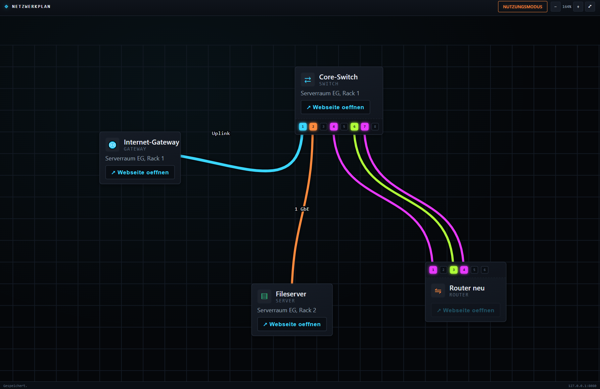

# Netzwerkplan

**Aktuelle Version: 1.8.0** – siehe [CHANGELOG.md](CHANGELOG.md) für alle
Änderungen.

Ein lokal laufender Webserver, der einen interaktiven Netzwerkplan bereitstellt
(frei platzierbare Elemente wie Switches, Router, Server, PCs, Raspberry Pis,
Kameras, Patchfelder usw., verbunden durch farbige Linien). Erreichbar unter
der IP des Rechners im lokalen Netzwerk. Dark-Theme im Stil von
Anduril Lattice, Verbindungslinien im Stil von harness.design.

## 1. Benötigte Python-Pakete

Python 3.10+ wird empfohlen. Installation der Pakete:

```bash
pip install -r requirements.txt
```

entspricht:

```bash
pip install Flask==3.0.3
pip install pyinstaller==6.10.0
```

- **Flask** – der Webserver, der die Oberfläche ausliefert und die
  Konfiguration per REST-API speichert/lädt.
- **PyInstaller** – zum Erzeugen der eigenständigen `.exe`.

Alles andere (HTML/CSS/JS) läuft im Browser des Nutzers, es sind keine
weiteren Pakete nötig.

## 2. Programm direkt starten (zum Testen)

```bash
python app.py
```

Danach ist die Oberfläche erreichbar unter:

- `http://127.0.0.1:8080` (lokal)
- `http://<IP-des-PCs>:8080` (im Netzwerk – die genaue IP wird beim Start
  in der Konsole ausgegeben)

Der Port lässt sich in `config.json` unter `server.port` ändern.

## 3. Ordnerstruktur

```
netzwerkplan/
├── app.py              Flask-Server
├── config.json          Konfiguration (Ansicht, Elemente, Verbindungen)
├── requirements.txt
├── templates/
│   └── index.html
└── static/
    ├── style.css
    └── app.js
```

## 4. Automatischer Build per GitHub Actions (empfohlen)

Dieses Repository enthält bereits den Workflow
`.github/workflows/build-exe.yml`. Er baut die `.exe` automatisch auf
GitHubs Windows-Runnern – es muss also kein Windows-Rechner lokal
vorhanden sein.

**Vorgehen:**

1. Repository-Inhalt (alle Dateien und Ordner dieses Projekts,
   inklusive `.github/`) in ein neues GitHub-Repository pushen:
   ```bash
   git init
   git add .
   git commit -m "Netzwerkplan"
   git branch -M main
   git remote add origin https://github.com/<dein-benutzername>/<dein-repo>.git
   git push -u origin main
   ```
2. Der Workflow startet automatisch beim Push auf `main` (auch manuell
   auslösbar über den Reiter **Actions → Build Windows EXE → Run
   workflow**).
3. Nach ca. 1–2 Minuten ist der Build unter **Actions → [letzter Lauf] →
   Artifacts → Netzwerkplan-Windows** als ZIP herunterladbar. Es enthält
   `Netzwerkplan.exe`, `config.json` und `README.md`.
4. Für ein richtiges GitHub **Release** (dauerhafter Download-Link)
   zusätzlich einen Tag pushen, z. B.:
   ```bash
   git tag v1.0.0
   git push origin v1.0.0
   ```
   Der Workflow erstellt dann automatisch ein Release mit der exe als
   Anhang.

Der Workflow benötigt keine zusätzlichen GitHub Secrets – `GITHUB_TOKEN`
wird von GitHub Actions automatisch bereitgestellt.

## 4b. Alternative: manueller Build mit PyInstaller

Im Projektordner (dort, wo `app.py` liegt) folgenden Befehl ausführen:

**Windows (cmd/PowerShell):**

```bash
pyinstaller --onefile --name Netzwerkplan --add-data "templates;templates" --add-data "static;static" app.py
```

**macOS/Linux** (Trennzeichen `:` statt `;`):

```bash
pyinstaller --onefile --name Netzwerkplan --add-data "templates:templates" --add-data "static:static" app.py
```

Optional ohne Konsolenfenster (Windows, `pythonw`-Stil, IP/Status werden dann
nicht angezeigt – daher nur empfohlen, wenn das nicht benötigt wird):

```bash
pyinstaller --onefile --noconsole --name Netzwerkplan --add-data "templates;templates" --add-data "static;static" app.py
```

Nach dem Build liegt die fertige Datei unter `dist/Netzwerkplan.exe`.

## 5. Wichtig: config.json neben die exe legen

Beim ersten Start erzeugt das Programm automatisch eine `config.json` im
selben Verzeichnis wie die exe, falls noch keine vorhanden ist. Soll eine
vorbereitete Konfiguration (z. B. die hier mitgelieferte `config.json` mit
Beispielelementen) verwendet werden, einfach diese Datei manuell in
denselben Ordner wie `Netzwerkplan.exe` kopieren, bevor die exe gestartet
wird.

Die `config.json` ist reines, menschenlesbares JSON und enthält:

- `server` – Host/Port des Webservers
- `view` – Ansichtseinstellungen (Zoom, Position, Rasteranzeige, Einrasten,
  Rastergröße)
- `mode` – zuletzt aktiver Modus (`edit`/`use`)
- `elements` – alle platzierten Netzwerk-Elemente (Name, Ort, Typ,
  Position, verknüpfte Webseiten)
- `connections` – alle Verbindungen zwischen Elementen (Farbe, Stärke,
  Bezeichnung)

Sie kann bei Bedarf auch von Hand in einem Texteditor angepasst werden,
solange gültiges JSON erhalten bleibt.

## 6. Bedienung

- **Bearbeitungsmodus** (oben links umschaltbar): Elemente aus der Palette
  hinzufügen, per Drag & Drop verschieben (mit Raster/Einrasten), über den
  Stift-Button (✎) Name/Ort/Typ/Webseiten bearbeiten, über „Verbindung"
  zwei Elemente bzw. bei Switch/Router/Patchfeld zwei konkrete Ports
  nacheinander anklicken, um eine farbige Linie zu ziehen
  (Farbe/Stärke/Bezeichnung im Klick auf die Linie einstellbar).
  Bei Switch/Router/Patchfeld lassen sich die Ports über die Buttons „⟳"
  (Seite drehen) und „⇋" (Reihenfolge spiegeln) am Element ausrichten.
  Doppelklick auf einen einzelnen Port vergibt einen eigenen Portnamen
  (zusätzlich zur Nummer); alle Portnamen lassen sich auch gesammelt im
  Element-Dialog bearbeiten.
- **Mehrere Elemente gemeinsam verschieben:** Im Bearbeitungsmodus bei
  gehaltener Umschalttaste (Shift) auf leerer Fläche ziehen, um einen
  Auswahlrahmen aufzuziehen. Alle berührten Elemente werden markiert
  (orange Umrandung) – anschließend an einem davon ziehen, um alle
  markierten Elemente parallel zu verschieben. Klick auf leere Fläche
  ohne Shift oder Escape hebt die Auswahl wieder auf.
- **Leitungen bearbeiten:** Jede Leitung zeigt im Bearbeitungsmodus einen
  eigenen „✎"-Button (wie an den Elementen), der ein Menü öffnet, um die
  Bezeichnung zu ändern, die Farbe anzupassen, einen Wegpunkt an dieser
  Stelle einzufügen oder die Leitung einzeln zu entfernen. Ein Klick auf
  die Leitung selbst öffnet direkt den vollständigen Dialog mit
  zusätzlicher Einstellung für die Leitungsstärke und „Linie zurücksetzen"
  (entfernt alle Wegpunkte auf einmal).
- **Leitungen umlegen:** Über „+ Wegpunkt hier" im Kontextmenü lassen sich
  frei verschiebbare Wegpunkte setzen, um die Leitung gezielt um andere
  Elemente herumzuführen. Doppelklick auf einen vorhandenen Wegpunkt
  entfernt ihn wieder.
- **Bezeichnung platzieren:** Eine gesetzte Bezeichnung lässt sich per
  Ziehen frei verschieben (mit gestrichelter Führungslinie zur Leitung,
  wenn sie weiter weg gesetzt wird).
- **Mehrere Webseiten je Element:** Im Element-Dialog lassen sich beliebig
  viele Webseiten mit eigener Bezeichnung hinterlegen („+ Webseite
  hinzufügen"). Jede erscheint als eigene, benannte Schaltfläche direkt
  auf dem Element (z. B. „↗ Admin-Oberfläche", „↗ Grafana").
- **Nutzungsmodus**: Keine Änderungen möglich, es können ausschließlich
  über die Webseiten-Schaltflächen auf jedem Element die hinterlegten
  Seiten in neuen Tabs geöffnet werden.
- **Zoom/Pan**: Mausrad zum Zoomen, Ziehen auf leerer Fläche zum Verschieben
  der Ansicht, +/−/⤢ oben rechts als Alternative.
- **IP-Anzeige:** Jedes Element zeigt automatisch die aus der ersten
  hinterlegten Webseite extrahierte IP-Adresse bzw. den Hostnamen direkt
  auf der Karte an (z. B. „IP: 192.168.1.2").
- **Speichern**: Über den Button „Speichern" oder automatisch nach jeder
  Änderung (Elemente, Verbindungen) sowie leicht verzögert nach Zoom/Pan.
